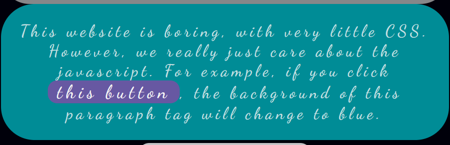

# Convert To Arrow

<aside>
💡 Convert each function below into modern arrow function syntax!

</aside>

### Links
 - [Notion Page Version](https://different-delivery-037.notion.site/Convert-To-Arrow-2060dfcb0c0f498a8aa8af8f915cd2ce?pvs=4)
 - [Section Notes](https://different-delivery-037.notion.site/Modern-JavaScript-9302deb4f93d48699228e16d600e360f?pvs=4)
    

### **Learning Objectives**
- Demonstrate a comprehension of the similarities and differences between JavaScript functions written in different syntax.
- Implement arrow functions to adhere to modern JavaScript standards and improve code readability.


# **Convert to Arrow:**


Take the following HTML and update all functions to arrow functions.

```
<!DOCTYPE html>
<html lang="en">
<head>
    <meta charset="UTF-8">
    <meta name="viewport" content="width=device-width, initial-scale=1.0">
    <meta http-equiv="X-UA-Compatible" content="ie=edge">
    <title>Arrow Functions</title>
</head>
<body id="body">
    <h1>My Boring Website</h1>
    <p id="paragraph">
        This website is boring, with very little CSS.
        However, we really just care about the javascript.
        For example, if you click <button id="button">this button</button>, the background of this paragraph tag will change to blue.
    </p>
    <p>We also have a <button id="alert">alert</button> button that will grab the text from the input below and show it in a popup.</p>
    <div>
        <input type="text" id="popup-input">
    </div>
    <p>
        We just like random interactivity in the site, including a fun effect if you hover over <span id="hover-this"><b>this.</b></span>
    </p>
    <p id="set-color" onclick="functionFromBelow('argumentOne', document.getElementById('argumentTwo').value)">
        We can click anywhere in this paragraph tag and it will change the background color to whatever is in this input: <input type="text" id="color-input"/>
    </p>
    <p onmouseover="mouseOverFunction(this)">
        Moving your mouse over this text will make it black, so you cannot read it!
    </p>
    <script>
        document.getElementById("button").onclick = function() {
            setBackgroundColorById("paragraph", "blue");
        }
        document.getElementById("alert").onclick = function(){
            alert(document.getElementById("popup-input").value);
        }
        document.getElementById("hover-this").onmouseover = function(){
            setBackgroundColorById("body", "red");
        }
        document.getElementById("hover-this").onmouseout = function(){
            setBackgroundColorById("body", "white");
        }
function getValueFromId(id){
            return document.getElementById(id).value;
        }
function setBackgroundColorById(id, color){
            document.getElementById(id).style = "background-color: " + color;
        }
function mouseOverFunction(el){
            el.style = "background-color: black";
        }
    </script></body>
</html>
copy
```


## Changing Background:




**Old**

```jsx
document.getElementById("button").onclick = function() {
    setBackgroundColorById("paragraph", "blue");
}
```

**New**

```jsx
document.getElementById("button").onclick = () => {
    // get the color
    color = document.getElementById("paragraph").style.backgroundColor;  
    // toggle between 
    color = (color == "") ? "rgba(0, 175, 185, 0.8)" : "";
    // sendddd iiittt!!!
    setBackgroundColorById("paragraph", color);
}
```

## Alert with Input


**Old**

```jsx
<p id="set-color" onclick="functionFromBelow('argumentOne', 
								document.getElementById('argumentTwo').value)">
function setBackgroundColorById(id, color){
    document.getElementById(id).style = "background-color: " + color;
}
```

**New**

```jsx
<p id="set-color" onclick="setBackgroundColorById('set-color', 
									document.getElementById('color-input').value)">

const setBackgroundColorById = (id, color) => {
    document.getElementById(id).style = "background-color: " + color;
}
```

## Background Color Change on Hoover


**Old**

```jsx
document.getElementById("hover-this").onmouseover = () => {
    setBackgroundColorById("body", "rgba(240, 113, 103, 0.8)");
}
document.getElementById("hover-this").onmouseout = () => {
    setBackgroundColorById("body", "white");
}
```

**New**

```jsx
document.getElementById("hover-this").onmouseover = () => {
    setBackgroundColorById("body", "rgba(240, 113, 103, 0.8)");
}

document.getElementById("hover-this").onmouseout = () => {
    setBackgroundColorById("body", "rgb(0, 0, 10)");
}
```

## Background Color Change on Click with Input


**Old**

```jsx
<p id="set-color" onclick="functionFromBelow('argumentOne', 
								document.getElementById('argumentTwo').value)">
function setBackgroundColorById(id, color){
    document.getElementById(id).style = "background-color: " + color;
}
```

**New**

```jsx
<p id="set-color" onclick="setBackgroundColorById('set-color', 
								document.getElementById('color-input').value)">
const setBackgroundColorById = (id, color) => {
    document.getElementById(id).style = "background-color: " + color;
}
```

## Mouse Over Change Background


**Old**

```jsx
function mouseOverFunction(el){
     el.style = "background-color: black";
 }
```

**New**

```jsx
const mouseOverFunction = el => 
			el.style = "background-color: rgba(0, 175, 185, 0.8)";
// added for fun
<p onmouseover="mouseOverFunction(this)" onmouseout="mouseOutFunction(this)
const mouseOutFunction = el => el.style = "background-color: ''";
```

## Full Changes

### Modularized and Arrows

```jsx
document.getElementById("button").onclick = () => {
    // get the color
    color = document.getElementById("paragraph").style.backgroundColor;  
    // toggle between 
    color = (color == "") ? "rgba(0, 175, 185, 0.8)" : "";
    // sendddd iiittt!!!
    setBackgroundColorById("paragraph", color);
}

document.getElementById("alert").onclick = () => {
    alert(document.getElementById("popup-input").value);
}

document.getElementById("hover-this").onmouseover = () => {
    setBackgroundColorById("body", "rgba(240, 113, 103, 0.8)");
}

document.getElementById("hover-this").onmouseout = () => {
    setBackgroundColorById("body", "rgb(0, 0, 10)");
}

const setBackgroundColorById = (id, color) => {
    document.getElementById(id).style = "background-color: " + color;
}

const getValueFromId = id => document.getElementById(id).value;

const mouseOverFunction = el => el.style = "background-color: rgba(0, 175, 185, 0.8)";
const mouseOutFunction = el => el.style = "background-color: ''";
```

### Original View vs My Spin


<!-- 👣FOOTER👣 -->
&nbsp;
<hr />
<p align="center">A work by <a href="https://github.com/xtina-lt/">Christina Torres</a></p>
<p align="center"><span style="color: #808080;"><em>xtina_lt@outlook.com</em></span></p>

<!-- Add icon library -->
<link rel="stylesheet" href="https://cdnjs.cloudflare.com/ajax/libs/font-awesome/4.7.0/css/font-awesome.min.css">

<!-- Add font awesome icons -->
<p style="text-align: center;">
    <a href="https://www.linkedin.com/in/xtinacodes/" class="fa fa-linkedin"></a>
    <a href="https://github.com/xtina-lt/" class="fa fa-github"></a>
</p>
&nbsp;
</div>