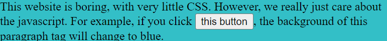

# Convert To Arrow

<aside>
💡 Convert each function below into modern arrow function syntax!

</aside>

### Links

- [Notion Version](https://www.notion.so/Convert-To-Arrow-0d91444e0a3b4f149b929846571b449e?pvs=21)
- GitHub Repo
- Notes

### **Learning Objectives**

- Demonstrate a comprehension of the similarities and differences between JavaScript functions written in different syntax.
- Implement arrow functions to adhere to modern JavaScript standards and improve code readability.

---

This practice assignment will reinforce important learning objectives from the previous lesson(s), and allow you to take on more challenging core assignments, preparing you for graduation.

Practice and tinker with this assignment until you're comfortable performing each of the tasks. Then, be sure to submit your output as described in the steps below.

---

# **Convert to Arrow:**

You are at a company that does not have a great front end for its website, but they pride themselves on their JavaScript. Since they only care about adding random JavaScript functionality, they don't want you to change the CSS of this site. They have given you a task to update the Javascript in their site to ES6, so that every method being called uses arrow functions.

<aside>

    💡Take the following HTML and update all functions to arrow functions.
</aside>

```
<!DOCTYPE html>
<html lang="en">
<head>
    <meta charset="UTF-8">
    <meta name="viewport" content="width=device-width, initial-scale=1.0">
    <meta http-equiv="X-UA-Compatible" content="ie=edge">
    <title>Arrow Functions</title>
</head>
<body id="body">
    <h1>My Boring Website</h1>
    <p id="paragraph">
        This website is boring, with very little CSS.
        However, we really just care about the javascript.
        For example, if you click <button id="button">this button</button>, the background of this paragraph tag will change to blue.
    </p>
    <p>We also have a <button id="alert">alert</button> button that will grab the text from the input below and show it in a popup.</p>
    <div>
        <input type="text" id="popup-input">
    </div>
    <p>
        We just like random interactivity in the site, including a fun effect if you hover over <span id="hover-this"><b>this.</b></span>
    </p>
    <p id="set-color" onclick="functionFromBelow('argumentOne', document.getElementById('argumentTwo').value)">
        We can click anywhere in this paragraph tag and it will change the background color to whatever is in this input: <input type="text" id="color-input"/>
    </p>
    <p onmouseover="mouseOverFunction(this)">
        Moving your mouse over this text will make it black, so you cannot read it!
    </p>
    <script>
        document.getElementById("button").onclick = function() {
            setBackgroundColorById("paragraph", "blue");
        }
        document.getElementById("alert").onclick = function(){
            alert(document.getElementById("popup-input").value);
        }
        document.getElementById("hover-this").onmouseover = function(){
            setBackgroundColorById("body", "red");
        }
        document.getElementById("hover-this").onmouseout = function(){
            setBackgroundColorById("body", "white");
        }
function getValueFromId(id){
            return document.getElementById(id).value;
        }
function setBackgroundColorById(id, color){
            document.getElementById(id).style = "background-color: " + color;
        }
function mouseOverFunction(el){
            el.style = "background-color: black";
        }
    </script></body>
</html>
copy
```

- [x]  Update all functions to utilize arrow function syntax
- [x]  Connect the EventListener `setBackgroundColorById` to the paragraph element with an id attribute of "set-color" in the HTML

---
## Changing Background:



**Old**

```jsx
document.getElementById("button").onclick = function() {
    setBackgroundColorById("paragraph", "blue");
}
```

**New**

```jsx
document.getElementById("button").onclick = () => {
    setBackgroundColorById("paragraph", "rgba(0, 175, 185, 0.8)");
}
```

---
## Alert with Input


**Old**

```jsx
<p id="set-color" onclick="functionFromBelow('argumentOne', 
								document.getElementById('argumentTwo').value)">
function setBackgroundColorById(id, color){
    document.getElementById(id).style = "background-color: " + color;
}
```

**New**

```jsx
<p id="set-color" onclick="setBackgroundColorById('set-color', 
									document.getElementById('color-input').value)">

const setBackgroundColorById = (id, color) => {
    document.getElementById(id).style = "background-color: " + color;
}
```

---
## Background Color Change on Hoover


**Old**

```jsx
document.getElementById("hover-this").onmouseover = () => {
    setBackgroundColorById("body", "rgba(240, 113, 103, 0.8)");
}
document.getElementById("hover-this").onmouseout = () => {
    setBackgroundColorById("body", "white");
}
```

**New**

```jsx
document.getElementById("hover-this").onmouseover = () => {
      setBackgroundColorById("body", "rgba(240, 113, 103, 0.8)");
  }
  document.getElementById("hover-this").onmouseout = () => {
      setBackgroundColorById("body", "white");
  }
```

---
## Background Color Change on Click with Input


**Old**

```jsx
<p id="set-color" onclick="functionFromBelow('argumentOne', 
								document.getElementById('argumentTwo').value)">
function setBackgroundColorById(id, color){
    document.getElementById(id).style = "background-color: " + color;
}
```

**New**

```jsx
<p id="set-color" onclick="setBackgroundColorById('set-color', 
								document.getElementById('color-input').value)">
const setBackgroundColorById = (id, color) => {
    document.getElementById(id).style = "background-color: " + color;
}
```

---
## Mouse Over Change Background


**Old**

```jsx
function mouseOverFunction(el){
            el.style = "background-color: black";
        }
```

**New**

```jsx
const mouseOverFunction = el => el.style = "background-color: black";
```

---
## Full Changes

```html
<!DOCTYPE html>
<html lang="en">
<head>
    <meta charset="UTF-8">
    <meta name="viewport" content="width=device-width, initial-scale=1.0">
    <meta http-equiv="X-UA-Compatible" content="ie=edge">
    <title>Arrow Functions</title>
</head>
<body id="body">
    <h1>My Boring Website</h1>
    <p id="paragraph">
        This website is boring, with very little CSS. 
        However, we really just care about the javascript. 
        For example, if you click <button id="button">this button</button>, the background of this paragraph tag will change to blue.
    </p>
    <div>
        <input type="text" id="popup-input">
    </div>
    <p>We also have a <button id="alert">alert</button> button that will grab the text from the input and show it in a popup.</p>
    <p>
        We just like random interactivity in the site, including a fun effect if you hover over <span id="hover-this"><b>this.</b></span>
    </p>
    <p id="set-color" onclick="setBackgroundColorById('set-color', document.getElementById('color-input').value)">
        We can click anywhere in this paragraph tag and it will change the background color to whatever is in this input: <input type="text" id="color-input"/>
    </p>
    <p onmouseover="mouseOverFunction(this)">
        Moving your mouse over this text will make it black, so you cannot read it!
    </p>
    <script>
        document.getElementById("button").onclick = () => {
            setBackgroundColorById("paragraph", "rgba(0, 175, 185, 0.8)");
        }
        document.getElementById("alert").onclick = () => {
            alert(document.getElementById("popup-input").value);
        }
        document.getElementById("hover-this").onmouseover = () => {
            setBackgroundColorById("body", "rgba(240, 113, 103, 0.8)");
        }
        document.getElementById("hover-this").onmouseout = () => {
            setBackgroundColorById("body", "white");
        }
        const setBackgroundColorById = (id, color) => {
            document.getElementById(id).style = "background-color: " + color;
        }
        const getValueFromId = id => document.getElementById(id).value;
        const mouseOverFunction = el => el.style = "background-color: black";
    </script>
</body>
</html>
```